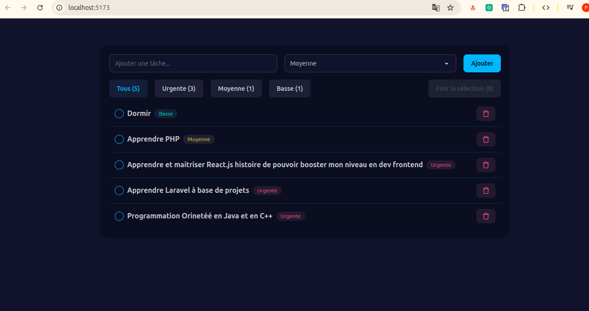

# Todo-list-app

This is a simple Todo-app. User can add task to do by precise their importance or priority, delete some of them. He can also filter task by click on the priority that will be use for filtering.

## Technologies
- React + TypeScript
- Vite
- Tailwind CSS
- Firebase (auth + base de données)

